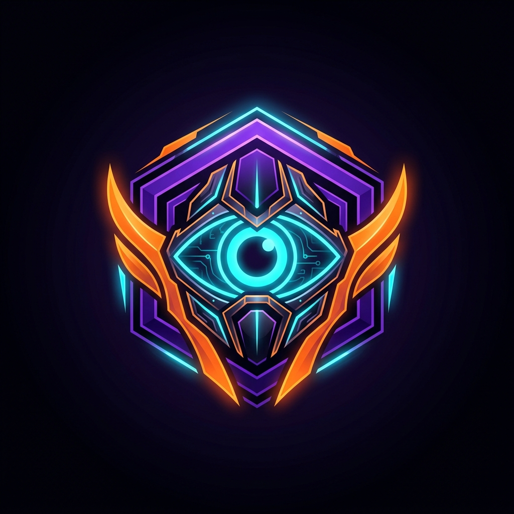

<div align="center">
  
  <h1>DreamSentinel AI</h1>
  <p><strong>The Autonomous Swarm Intelligence for DreamDEX Event Contracts on Somnia L1.</strong></p>
  
  [](https://dorahacks.io/hackathon/event-contracts/buidl)
  [](https://opensource.org/licenses/MIT)
</div>

---

## 🏆 Somnia × DreamDEX Hackathon Submission

DreamSentinel AI is a next-generation **AI-powered trading infrastructure** built to solve liquidity and adoption challenges on prediction markets. By leveraging **Bayesian probabilistic models**, the **Kelly Criterion**, and Somnia's ultra-fast L1 architecture, our Autonomous Agent Swarm trades Event Contracts with zero human intervention.

### 🔥 Key Features Built for the Hackathon

1. **Autonomous AI Swarm (Backend)**: 
   - A Python-based agentic system with roles (Alpha-Scalper, Bayesian-Arb, Macro-Hedger) that actively analyzes market sentiment and order book imbalances to place live trades.
2. **Glassmorphism Trading Terminal (Frontend)**: 
   - A highly responsive Next.js dashboard featuring live TradingView charts, real-time AI thought streaming, and intuitive control panels.
3. **Copy-Trading Vaults (Smart Contracts)**: 
   - An ERC-4626 standard `DreamSentinelVault.sol` deployed on **Somnia Testnet** allowing users to passively deposit $USDso and let the AI manage their portfolio.
4. **PvP 60s Micro-Duels**: 
   - `PvPDuelEscrow.sol` introduces gamified 60-second binary event duels where users compete against each other or the AI.
5. **Cross-Market Arbitrage Scanner**: 
   - Real-time radar identifying probabilistic discrepancies across markets to execute risk-free arbitrage.
6. **Telegram Mini-App Integration**: 
   - Mobile-first approach allowing users to receive arbitrage alerts and trade directly from Telegram.

---

## 🏗️ Architecture & Tech Stack

- **Blockchain**: Somnia Shannon Testnet (Smart Contracts in Solidity)
- **Backend / AI Engine**: Python 3, FastAPI, Web3.py, asyncio
- **Frontend / UI**: Next.js 15, React, Tailwind CSS, Lightweight-Charts (TradingView)
- **Omnichannel**: Telegram Bot API

---

## 🚀 Quick Start (Run Locally)

### 1. Smart Contracts
```bash
cd contracts
npm install
# Ensure you have a funded private key in .env
npm run deploy:somnia
```

### 2. AI Backend Engine
```bash
cd agent-core
pip install -r requirements.txt
uvicorn server:app --reload --host 0.0.0.0 --port 8000
```

### 3. Frontend Terminal
```bash
cd frontend
npm install
npm run dev
# App will run on http://localhost:3000
```

---

## 📜 Deployed Contracts (Somnia Testnet)
- **Mock USDso**: `0xc3260e68Cd634Ba9A7f0BA125e4640ccd916F1AE`
- **DreamSentinelVault**: `0x7F4EA982ef392D1e7F46798fE7618e31F1bE689a`
- **PvPDuelEscrow**: `0x773D7953a12F070618C8f7061435a9C020dA6F2A`

---

*“Predicting the future by computing it.”* — **The DreamSentinel Team**
